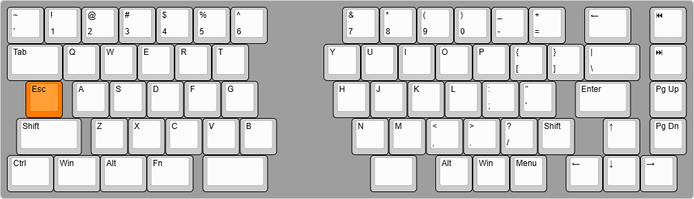

# AlteraKbd Firmware

The Altera Keyboard is a keyboard designed with inspiration from the [Caldera Keyboard](https://github.com/christianselig/caldera-keyboard) and [Keebio Sinc](https://keeb.io/products/sinc-rev-4-split-staggered-75-keyboard)

It is (my first) fully custom designed keyboard.

## Features
 - Custom Split wireless 60% layout with dedicated Home, End, Page Up and Down keys.
 - No Caps Lock key (Who ever deliberately used that anyway)
 - Standard QWERTY layout with MX key spacing, so swapping keyboards is as easy as can be